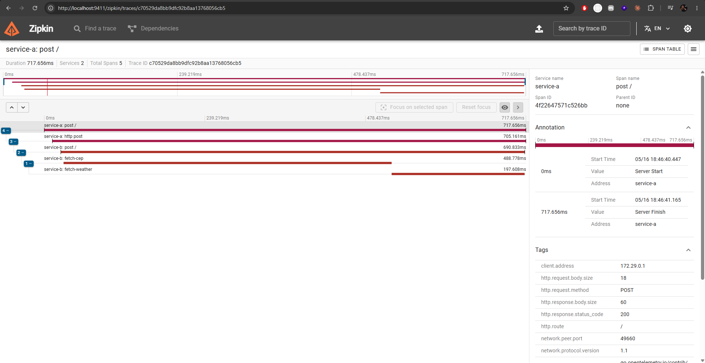

# go-expert-otel

## Setup

### 1. Configurar Variáveis de Ambiente

- [ ] Altere o `docker-compose.yaml` a variável `WEATHER_API_KEY` para sua chave da WeatherAPI:

### 2. Rodar o Sistema

```bash
docker-compose up --build
```

- [ ] Aguarde até os serviços subirem

## Testando a Aplicação

### Cep válido:

```bash
curl -X POST http://localhost:8080 -H "Content-Type: application/json" -d '{"cep":"01310100"}'
```

- [ ] Resposta esperada (a temperatura estará diferente)

```json
{ "city": "São Paulo", "temp_C": 28.5, "temp_F": 83.3, "temp_K": 301.65 }
```

### Cep inválido:

```bash
curl -X POST http://localhost:8080 -H "Content-Type: application/json" -d '{"cep":"123"}'
```

- [ ] Deve retornar: HTTP 422 - `invalid zipcode`

### Cep não encontrado:

```bash
curl -X POST http://localhost:8080 -H "Content-Type: application/json" -d '{"cep":"00000000"}'
```

- [ ] Deve retornar: HTTP 404 - `can not find zipcode`

## Visualizando Traces no Zipkin

1. Acesse http://localhost:9411
2. Clique em "Run Query"
3. Veja os traces das requisições:
   - Serviço A recebendo requisição
   - Serviço A chamando Serviço B
   - Serviço B consultando ViaCEP (span "fetch-cep")
   - Serviço B consultando WeatherAPI (span "fetch-weather")


